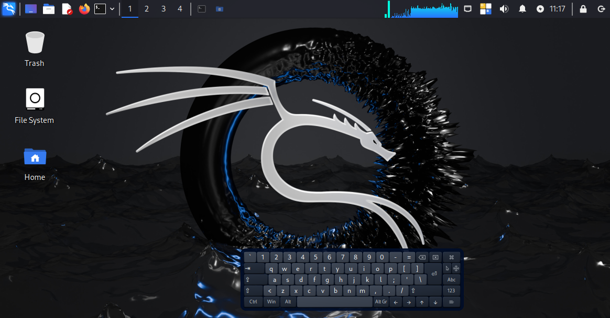
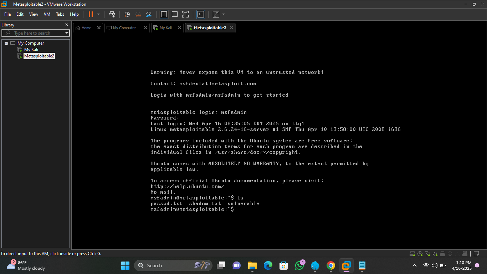
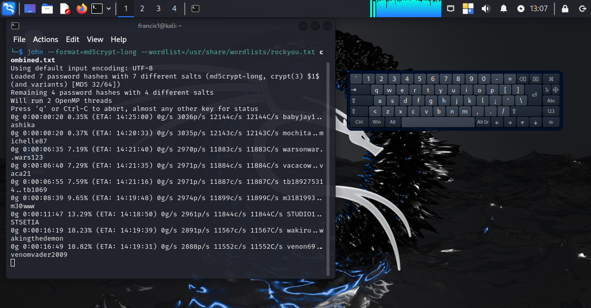
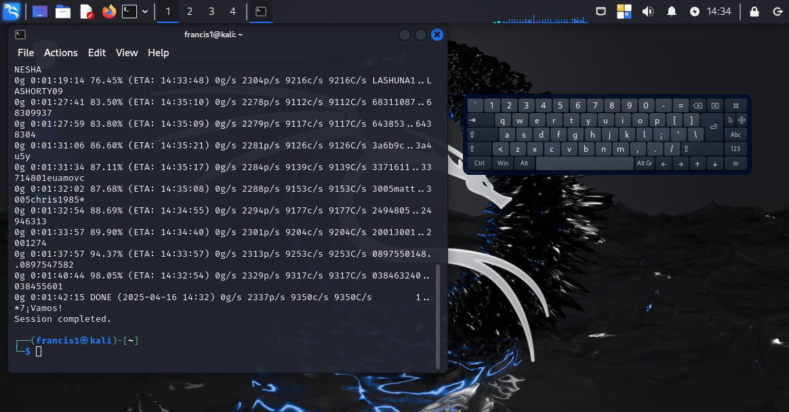
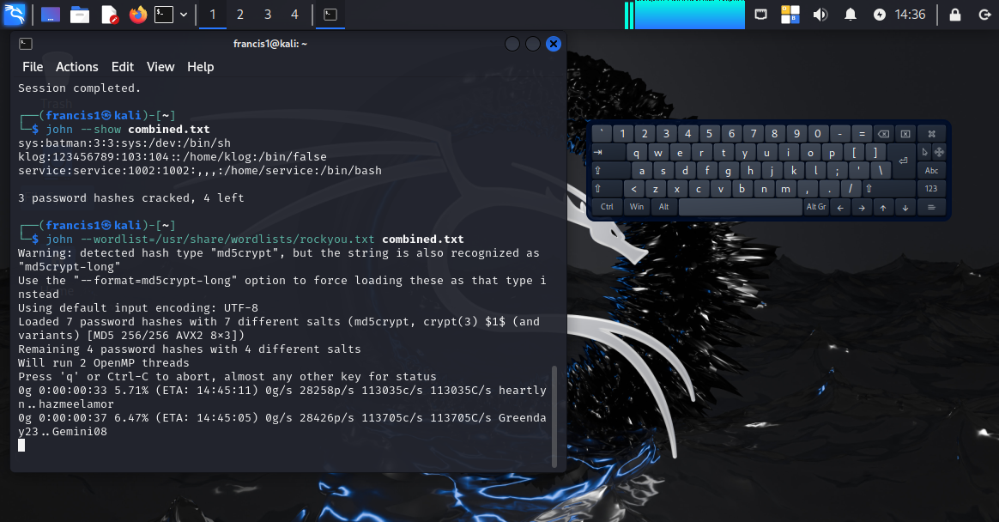

# 🔐 Password Cracking on Open-Source System (Metasploitable2)

## 📌 Project Objective
Recover user passwords from an open-source system using password-cracking tools like **John the Ripper**, or **Hashcat**. The goal is to demonstrate techniques used in password recovery and understand system vulnerabilities while learning how to mitigate these threats effectively.

---

## 🛠️ Tools & Technologies Used

| Tool | Purpose |
|------|---------|
| **Metasploitable2** | Vulnerable virtual machine used as the target system |
| **John the Ripper** | Password hash cracking tool |
| **Hashcat** (optional) | GPU-based password recovery tool |
| **rockyou.txt** | Common password wordlist used for dictionary attacks |
| **Kali Linux | Attacker machine with pre-installed security tools |

---

## 🧪 Environment Setup

- **Host System**: VirtualBox or VMware installed on local machine
- - **Attacker**: Kali Linux
    
- **Target**: Metasploitable2 VM
  
- **Network Mode**: Host-only or Internal to simulate a secure lab

---

## 🔄 Methodology (Step-by-Step)

### Step 1: Extract Password Hashes

- Gain access to the `/etc/shadow` and `/etc/passwd` files on the target (e.g., via a known exploit or misconfigured privilege)
- Combine both files using:
  ```bash
  unshadow /etc/passwd /etc/shadow > combined.txt
  ```

### Step 2: Crack Passwords Using John the Ripper

- Run John with a wordlist:
  ```bash
  john --wordlist=/usr/share/wordlists/rockyou.txt --format=sha512crypt combined.txt
  ```
- View cracked passwords:
  ```bash
  john --show combined.txt
  ```
---

## 🧩 Challenges Faced and Solutions
During the execution of this project, I encountered a few key challenges that helped deepen my understanding of real-world troubleshooting in cybersecurity environments:

### 1. Black Screen Issue on Metasploitable2 Boot
Upon starting the Metasploitable2 VM, the screen remained blank. This was resolved by switching the VM's graphics settings to use "Accelerate 3D graphics" or rebooting the VM cleanly from VMware’s interface.

### 2. SSH Connection Error – No Matching Host Key Type
While trying to SSH from Kali to Metasploitable2, an error occurred due to deprecated host key algorithms. I resolved it by creating a custom SSH config file that explicitly allowed the older key types ssh-rsa and ssh-dss.

### 3. Permission Denied on Shadow File Copy
Attempting to SCP the shadow file resulted in a permission error. Since elevated permissions are required to access /etc/shadow, I used sudo cp within the VM to copy it to a readable location (/home/msfadmin/) before transferring.

### 4. Wordlist Not Found
When using John the Ripper with the rockyou.txt wordlist, an error indicated the file was missing. I corrected this by extracting the compressed version using:
`sudo gzip -d /usr/share/wordlists/rockyou.txt.gz`

These obstacles not only tested my patience and problem-solving skills but also reinforced the importance of adaptable troubleshooting in cybersecurity workflows.

---

## 📸 Screenshots

> ✅ Include screenshots of:
> - Cracking process in terminal


> - Successfully recovered passwords


---

## 🛡️ Mitigation Recommendations

To reduce the risk of password cracking:

- Use **complex, lengthy passwords** (avoid dictionary words)
- Enforce **password rotation** and **account lockouts** after failed login attempts
- Apply **salting and hashing** (e.g., bcrypt, scrypt) before storing passwords
- Implement **Multi-Factor Authentication (MFA)**
- Conduct regular **security audits** and **user education**

---

## ✅ Lessons Learned

- Hands-on exposure to real-world password cracking techniques
- Importance of password complexity and system hardening
- Understanding how adversaries exploit weak security configurations

---

Date: 17th April, 2025.
